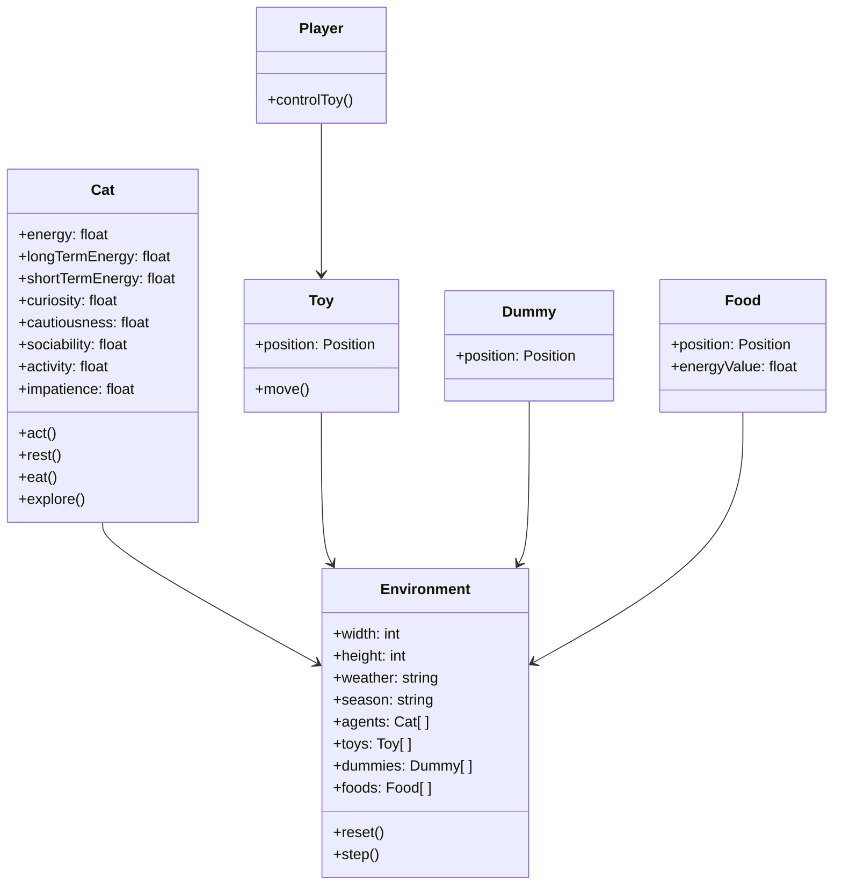

# ドメインモデル（Mermaid記法）

```mermaid
classDiagram
    class Cat {
        +energy: float
        +longTermEnergy: float
        +shortTermEnergy: float
        +curiosity: float
        +cautiousness: float
        +sociability: float
        +activity: float
        +impatience: float
        +act()
        +rest()
        +eat()
        +explore()
    }
    class Toy {
        +position: Position
        +move()
    }
    class Dummy {
        +position: Position
    }
    class Food {
        +position: Position
        +energyValue: float
    }
    class Environment {
        +width: int
        +height: int
        +weather: string
        +season: string
        +reset()
        +step()
        +agents: Cat[ ]
        +toys: Toy[ ]
        +dummies: Dummy[ ]
        +foods: Food[ ]
    }
    class Player {
        +controlToy()
    }
    Cat --> Environment
    Toy --> Environment
    Dummy --> Environment
    Food --> Environment
    Player --> Toy
```

---

- Cat（ねこ）はEnvironment（環境）内で行動し、Toy（おもちゃ）やFood（食べ物）などと相互作用します。
- Player（プレイヤー）はToyを操作し、ねことのインタラクションを楽しみます。
- 各エージェントや環境の属性・行動は今後の拡張性も考慮して設計しています。
