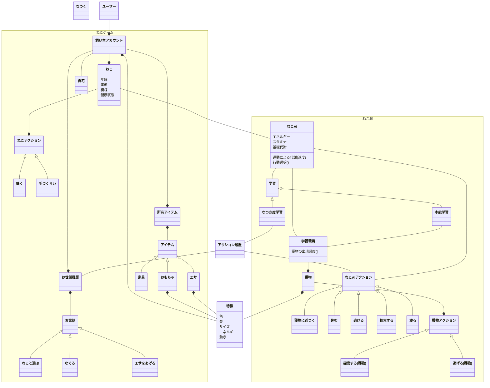

```mermaid
classDiagram
  namespace ねこゲーム{
    class ねこ {
      年齢
      体形
      模様
      健康状態
    }
    class 飼い主アカウント
    class 所有アイテム
    class アイテム
    class おもちゃ
    class エサ
    class 家具
    class お世話
    class お世話履歴
    class ねこと遊ぶ
    class なでる
    class エサをあげる
    class 自宅
    class ねこアクション
    class 鳴く
    class 毛づくろい
  }
  namespace ねこ脳 {
    class 獲物{
    }
    class 学習環境{
      獲物の出現頻度[]
    }
    class ねこAI {
      エネルギー
      スタミナ
      基礎代謝
      運動による代謝(速度)
      行動選択()
    }
    class ねこAIアクション
    class 獲物に近づく
    class 休む
    class 逃げる
    class 探索する
    class 寝る
    class 獲物アクション
    class `探索する(獲物)`
    class `逃げる(獲物)`
    class 学習
    class なつき度学習
    class 本能学習
  }

  class 特徴{
    色
    音
    サイズ
    エネルギー
    動き
  }
  class なつく
  class アクション履歴

  飼い主アカウント --* お世話履歴
  お世話履歴 *-- お世話
  お世話 <|-- ねこと遊ぶ
  お世話 <|-- なでる
  お世話 <|-- エサをあげる
  ねこアクション <|-- 鳴く
  ねこアクション <|-- 毛づくろい
  ユーザー --* 飼い主アカウント
  飼い主アカウント -- 自宅
  ねこAI -- 学習環境
  飼い主アカウント --* ねこ
  ねこ --* ねこアクション
  飼い主アカウント --* 所有アイテム
  所有アイテム *-- アイテム
  アイテム <|--おもちゃ
  アイテム <|-- エサ
  アイテム <|-- 家具
  
  ねこ -- ねこAI
  アクション履歴 -- お世話履歴
  アクション履歴 -- ねこAIアクション
  獲物 *-- 特徴
  飼い主アカウント *-- 特徴
  おもちゃ *-- 特徴
  エサ *-- 特徴

  ねこAI -- ねこAIアクション
  ねこAIアクション <|-- 獲物に近づく
  ねこAIアクション <|-- 休む
  ねこAIアクション <|-- 逃げる
  ねこAIアクション <|-- 探索する
  ねこAIアクション <|-- 寝る
  学習環境 --* 獲物
  獲物 --* 獲物アクション
  獲物アクション <|-- `探索する(獲物)`
  獲物アクション <|-- `逃げる(獲物)`
  学習 <|-- なつき度学習
  学習 <|-- 本能学習
  本能学習 -- 学習環境
  なつき度学習 -- アクション履歴
  ねこAI -- 学習
```