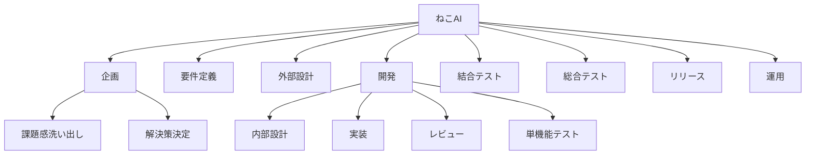

# 全体計画
マネジメント観点で、計画をまとめる。

## 開発方針
- 初期リリース（Step1）
  - Minimum Viable Product（MVP）で行う。
  - 最低限、ユーザーが画面操作で1機能（例：簡易版ゲームのプレイ）を行える状態を目指す。
  - 要件定義～リリースまでを1ヶ月で行える範囲とする。
  - アーキテクチャにはこだわらず、開発容易性を最優先とする。
  - 非機能要件は優先度低く考える。ただし、将来的にエンハンス開発を行う事を想定するため、著しく拡張性の低い実装は避けるものとする。
  - モノリスでも構わない。
- Step2以降
  - 段階的に、機能の実装orリファクタリングを進めていく。
  - 基本方針としては、機能の実装が優先である。
  - リファクタリングを行う基準は、ユーザーへの影響度の高さである。
    - 例：可用性に問題があり、ユーザー影響がある。
    - 例：変更容易性に乏しく、機能開発の速度が著しく低下している。

## WBS

## 要件定義
### 成果物一覧
- システムコンテキスト図
~~- 要求モデル~~
- ビジネスコンテキスト図
  - ビジネスユースケース図: ビジネスコンテキスト図と一つの図にまとめる
- 業務フロー図
- 利用シーン図
- バリエーション図
- ユースケース図
- 情報モデル
- 状態モデル
- 概念モデル
- 画面設計図
- API一覧
- バッチ一覧
- 学習データ/精度定義
- その他
  - 運用設計書